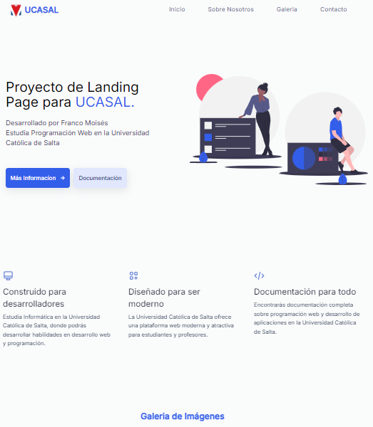

# 🌐 Landing Page - Universidad Católica de Salta

Este proyecto es una **Landing Page educativa** desarrollada como parte de un proyecto universitario en la **Universidad Católica de Salta** (UCASAL). 🚀  
La página está diseñada para reflejar la identidad institucional y brindar una experiencia sencilla e informativa para los usuarios.  

---

## 🛠️ Tecnologías utilizadas

- **HTML5**: Estructura de la página.  
- **CSS3**: Estilos personalizados para un diseño visual atractivo.  
- **JavaScript**: Funcionalidades dinámicas e interactivas.  

---

## ✨ Características principales

- 📄 **Diseño responsivo**: Adaptado para diferentes dispositivos (PC, tablet, móvil).  
- 🎨 **Estilo moderno**: Enfocado en usabilidad y atractivo visual.  
- 🌟 **Elementos dinámicos**: Uso de animaciones y scripts para mejorar la experiencia del usuario.  
- 🖼️ **Imágenes relevantes**: Incluye elementos visuales representativos de la UCASAL.  

---

## 🎯 Propósito del proyecto

Este proyecto fue creado como parte de mi formación en Ingeniería en Informática, con el objetivo de:  
1. Demostrar habilidades en desarrollo web front-end.  
2. Crear un diseño funcional que represente a la **Universidad Católica de Salta**.  
3. Aplicar buenas prácticas de desarrollo, como el uso de código limpio y reutilizable.  

---
## 📂 Estructura del proyecto

```plaintext
📦 Landing-Page-UCASAL
┣ 📂 css
┃ ┗ styles.css
┣ 📂 img
┃ ┗ (Imágenes utilizadas en el proyecto)
┣ 📄 index.html
┣ 📄 script.js
```
## 🖥️ Cómo ejecutar el proyecto

1. Clona este repositorio en tu máquina local:
   ```bash
   git clone https://github.com/FJMoisesRomero/Landing-Page-UCASAL.git
Abre el archivo index.html en tu navegador favorito.


## Puedes Visitar la página en https://fjmoisesromero.github.io/Landing-Page-UCASAL/


🏫 Sobre la Universidad Católica de Salta (UCASAL)
La Universidad Católica de Salta es una institución educativa comprometida con la formación académica y profesional de excelencia en Argentina. Esta landing page está diseñada para resaltar su misión y valores educativos.

🤝 Contribuciones
¡Siempre son bienvenidas! Si deseas mejorar esta landing page, no dudes en hacer un fork del repositorio y enviar tus propuestas.
